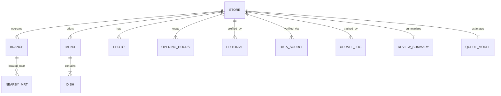

# 魚麵日和 (GYOMEN BIYORI) — 資料模型規格書 (Data Model Spec)

> **文件版本**：v1.0  
> **關聯文件**：[`/docs/PRD-v1.md`](file:///Users/kevinwu/Downloads/gyomen-biyori%202/docs/PRD-v1.md)

---

## 1. 架構概述 (Architecture Overview)

為了支援可擴充的台北拉麵知識庫，資料模型擺脫單一 `seed.ts` 陣列限制，設計完整的領域實體 (Domain Entities)。

---

## 2. 實體定義 (Entity Definitions)

### 2.1 Store (品牌/店家)
拉麵店的主實體，代表一個拉麵品牌或獨立店面。

| 欄位 (Field) | 型別 (Type) | 說明 (Description) | 範例 (Example) |
|---|---|---|---|
| `id` | `UUID / String` | 唯一識別碼 | `"shop-ichiran-01"` |
| `name` | `String` | 店家完整名稱 | `"一蘭拉麵 台北本店"` |
| `brand` | `String` | 所屬品牌名稱 | `"一蘭"` |
| `slug` | `String` | URL 友善標籤 | `"ichiran-taipei-main"` |
| `area` | `String` | 所屬行政區/商圈 | `"信義區"` |
| `description` | `String` | 店家特色簡介 | `"來自日本福岡的豚骨拉麵名店..."` |
| `basePrice` | `Number` | 基本款招牌拉麵價格 (NT$) | `310` |
| `brothTypes` | `Array<BrothCategory>` | 湯頭分類標籤 | `["tonkotsu"]` |
| `noodleTypes` | `Array<NoodleType>` | 麵體分類標籤 | `["straight_thin"]` |
| `paymentMethods` | `Array<PaymentType>` | 支援之支付方式 | `["cash", "credit_card", "line_pay"]` |
| `parkingInfo` | `ParkingEntity` | 停車便利資訊 | `{ hasParking: false, nearbyParking: "松壽路地下停車場" }` |
| `dataQuality` | `"verified" \| "unverified"` | 資料品質驗證標記 | `"verified"` |
| `gyomenScore` | `GyomenScoreEntity` | 魚麵分評分實體 | `{ overall: 4.6, broth: 4.8, noodle: 4.5 }` |

---

### 2.2 Branch (分店實體)
支援連鎖拉麵店多分店地理資訊管理。

| 欄位 (Field) | 型別 (Type) | 說明 (Description) |
|---|---|---|
| `id` | `String` | 分店識別碼 |
| `storeId` | `String` | 關聯之 Store ID |
| `branchName` | `String` | 分店名稱（例：中山店） |
| `address` | `String` | 完整地址 |
| `coordinates` | `{ lat: number, lng: number }` | WGS84 經緯度座標 |
| `phone` | `String` | 聯絡電話 |

---

### 2.3 Nearby MRT (近捷運站資訊)
| 欄位 (Field) | 型別 (Type) | 說明 (Description) |
|---|---|---|
| `station` | `String` | 捷運站名稱（例：捷運中山站） |
| `exit` | `String` | 建議出口（例：1號出口） |
| `walkMinutes` | `Number` | 步行估算分鐘數 |

---

### 2.4 Menu & Dish (菜單與餐點)
| 欄位 (Field) | 型別 (Type) | 說明 (Description) |
|---|---|---|
| `id` | `String` | 餐點唯一識別碼 |
| `storeId` | `String` | 關聯之 Store ID |
| `name` | `String` | 餐點名稱（例：天然豚骨拉麵） |
| `price` | `Number` | 售價 (NT$) |
| `isSignature` | `Boolean` | 是否為招牌主打 |
| `spicinessLevel` | `Number` | 辣度標籤 (0–5) |
| `description` | `String` | 餐點描述與特點 |

---

### 2.5 Photo (照片資源)
| 欄位 (Field) | 型別 (Type) | 說明 (Description) |
|---|---|---|
| `id` | `String` | 照片識別碼 |
| `storeId` | `String` | 關聯之 Store ID |
| `url` | `String` | 照片完整 URL |
| `caption` | `String` | 照片圖說/說明 |
| `category` | `"cover" \| "dish" \| "storefront" \| "menu"` | 照片分類 |
| `sourceCredit` | `String` | 照片來源創作者/官方標註 |

---

### 2.6 Opening Hours (營業時間)
| 欄位 (Field) | 型別 (Type) | 說明 (Description) |
|---|---|---|
| `dayOfWeek` | `0 - 6` | 星期幾（0 代表週日） |
| `openTime` | `String` | 開店時間 (HH:mm) |
| `closeTime` | `String` | 關店時間 (HH:mm) |
| `isBreak` | `Boolean` | 是否午後休息 |
| `breakStartTime` | `String` | 休息開始時間 |
| `breakEndTime` | `String` | 休息結束時間 |

---

### 2.7 Queue Model (排隊預估模型)
| 欄位 (Field) | 型別 (Type) | 說明 (Description) |
|---|---|---|
| `level` | `"none" \| "under30" \| "long"` | 排隊程度分類 |
| `peakWaitMinutes` | `Number` | 尖峰預估排隊分鐘數 |
| `offPeakWaitMinutes` | `Number` | 離峰預估排隊分鐘數 |
| `queueRules` | `String` | 排隊規則說明（例：人數到齊方可登記） |

---

### 2.8 Editorial & Data Source (編輯短評與資料來源)
| 欄位 (Field) | 型別 (Type) | 說明 (Description) |
|---|---|---|
| `editorNote` | `String` | 小魚/編輯團隊獨家短評 |
| `recommendedDish` | `String` | 編輯最推薦必點 |
| `sources` | `Array<SourceItem>` | 資料來源列表 (`{ label, url, checkedAt }`) |
| `lastUpdated` | `String (ISO Date)` | 資料最後校對日期 |

---

### 2.9 Update Log (異動與版本日誌)
| 欄位 (Field) | 型別 (Type) | 說明 (Description) |
|---|---|---|
| `id` | `String` | 異動日誌 ID |
| `storeId` | `String` | 異動店家 ID |
| `updatedBy` | `String` | 更新人（編輯/CMS User） |
| `changeType` | `"price_change" \| "hours_update" \| "closure" \| "info_fix"` | 變更類型 |
| `timestamp` | `String (ISO Date)` | 變更時間戳記 |
